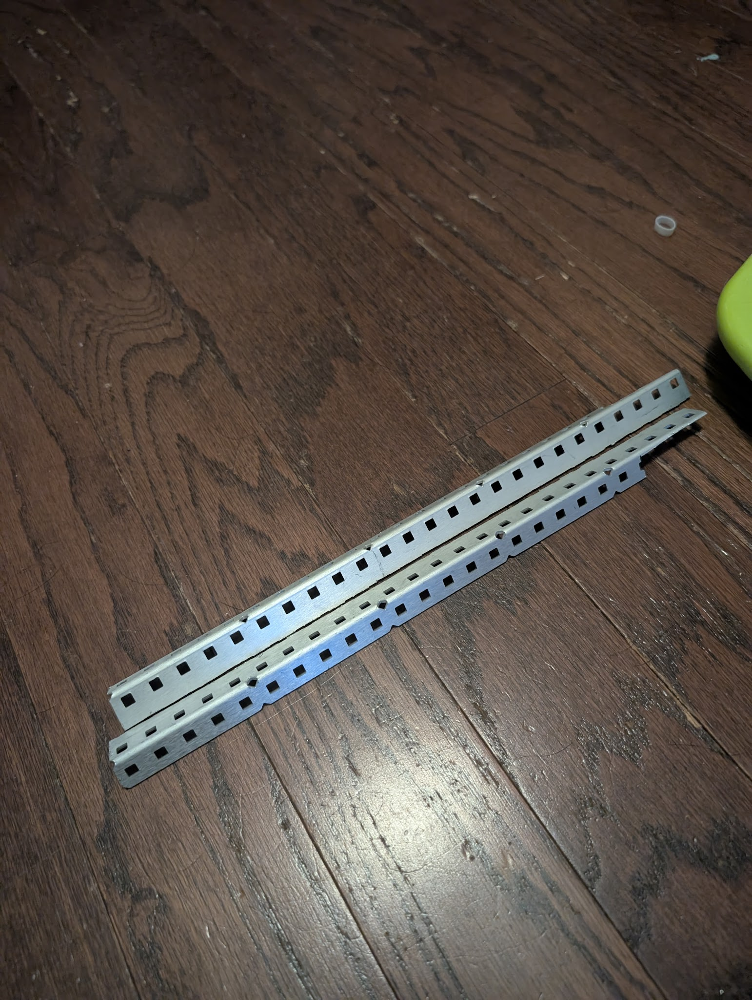
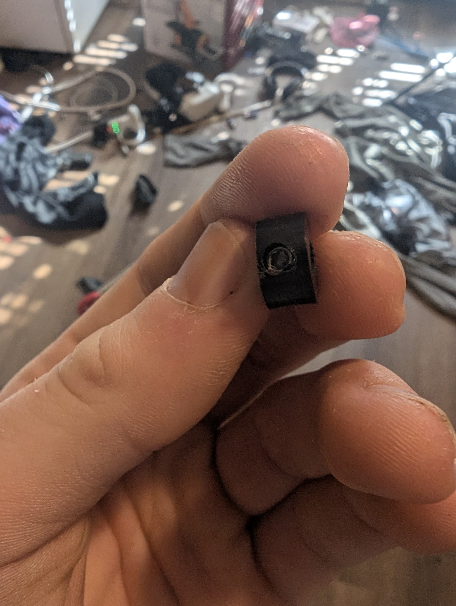
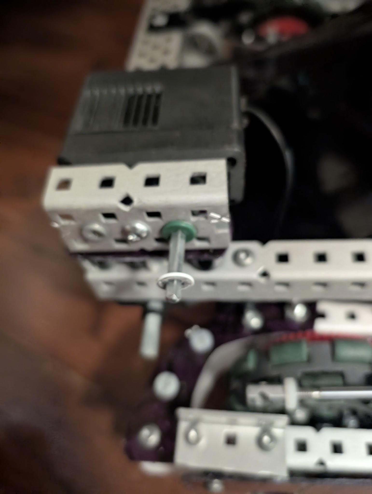
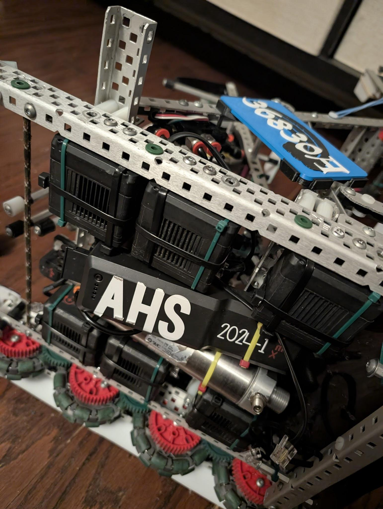
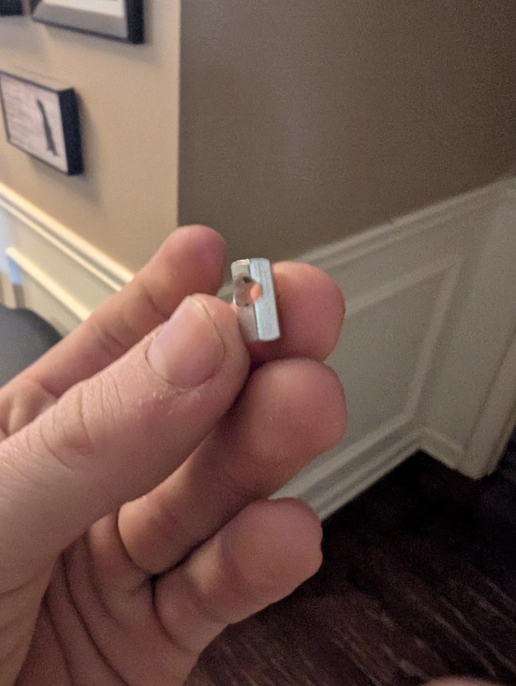
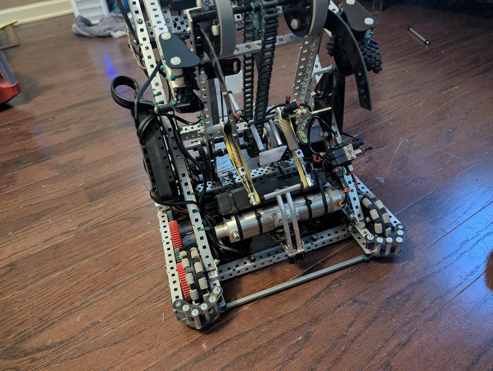

# Advanced Building Techniques
In this entry I will cover more advanced, uncommon building techniques. These will likely require more complex manufacturing processes and tools. These advanced techniques can be utilized to maximize the performance of your robot, save room in your build, and more.

## Half-Cut 3-Wide L-Channels
Half-cut 3-wide L-channels are thicker versions of the traditional L-channel. These are made by cutting a 3 wide C-channel in half and then sanding down the remaining nibs. Unlike normal L-channels, the holes aren't equal distances apart, which can contribute to clearance concerns.

Uses:

* **Structure**: these are my primary building material for structure because they are durable, light weight and compact.
* **Cross bars**: these *can* survive as a secondary full length cross bar. I do recommend using braces on them.

/// caption
Example
///

## Plastic Shaft Collars
Plastic shaft collars are made by tapping a .25 thin spacer with a 11/64" drill bit and then screwing a set screw into it. These are light weight and small and great tight places. They also come loose less then normal collars from my experience.

Uses:

* **Tight clearances**: in certain situations traditional shaft collars are too thick and aren't mountable. In these situations usually a plastic collar sub will fit since they are smaller
* **Weight saving**: plastic collars weight a fraction of a normal steel collar and can make significant gains in saving weight if used well. 
* **Structure?**: I've seen teams use these for structure (primally 99040N). While I'm never doing this personally, it's possible as a light weight alternative to shaft collar mounts.
* **Pistons**: it's possible to use these on the end of pistons too. I don't run this much but if made well they should hold.

/// caption
Example
///

## Circle-Insert Bearings
These are a compact alternative to traditional bearing flats, requiring one hole and zero screws. Use these to save room or just make your builds cleaner. Drill a high strength size hole and insert the circle insert and you are done. Circle inserts can be tight, so I also recommend drilling them out a hair for less friction.

Uses:

* **Tight clearances**: Use these when you want to save space.
* **Cantilever motor shafts**: Using these primarily on a cantilever motor shaft saves a lot of room and keeps the motor off a bearing flat; highly recommended.

/// caption
Circle inserts on a cantilevered motor.
///

/// caption
Circle inserts on a drivetrain.
///

## Drilled Standoffs
Drilled standoffs are standoffs with a hole drilled into the side. These can be used for mounting structure, bracing (for example drive gussets), and mounting pistons. These are great for both allowing custom dimensions and saving weight compared to shaft collar alternatives. Drilled standoffs can also save room in some cases.

Uses:

* **Mounting structure**: these can be used as an alternative to shaft collar and 1x1/1x2 gusset mounts. They are fairly light and can allow for more easily flush mounting. Only huge disadvantage to these being that standoffs come loose easily. I recommend using thread locker when using these as mounts.
* **Braces**: by drilling holes into the side of a drilled standoff you can effectively turn it into a .25” bar for bracing. This also allows custom dimensions which is useful for high level building. Due to the thinness of the metal at the holes drilled into the side these can become weak if manufactured/utilized improperly.
* **Piston mounts**: you can use these as a durable alternative to shaft collars as piston mounts. They are significantly better than traditional shaft collar mounts due to being lighter and more compact with more threads engaged on the piston. Only things to watch out for on these being them coming loose due to standoffs tendency to come loose (thermal expansion).

/// caption
Example
///

/// caption
A clamp utilizing advanced standoff tech
///

## Bent Standoffs
Bent standoffs are standoffs but bent (crazy I know). These don't have a set application but can be utilized in certain areas to alter geometries. There are 3 good examples of these being used, First in high stakes with my 4148z clamp design, 2nd in pushback on wings to avoid penalties, and 3rd for drive gussets that aren't perfectly straight. To make these you will need a basic pipe bender.

## Drilled High-Strength Shafts
Drilled high strength shafts (HS shaft) can be used for braces and in certain cases arms. Drilled HS shafts, if made properly, are the strongest brace you can use and also allow custom geometry. These are mainly used for strong drive cross-braces, usually in areas of impact. To make these, you will need a screw sized drill bit and I also recommend a shaft drilling jig (cad file TBD).

* **Metric tech**: While teams traditionally use the vex screw standard to mount these you can also use metric sized screws (for example M3) to mount these and keep extra material near the screw holes and increase durability

Uses:

* **Braces**: HS shafts are strong and compact braces that also look clean commonly used as cross bars
* **Arms**: they can be used as arms to create a long, durable, and slick arm. 
* **Wedges**: used for wedge structure.

## Half-Cut Gears
Half-cut gears (high strength gears in particular) are compact gears usually the thickness of .25” usually used to save room or weight. The manufacturing of these is challenging but the most common method is either a cnc (for example a 3018 style CNC router) or a angle grinder and skill.

Uses:

* **Clearance**: smaller gears is more room and these are sometimes needed for some designs due to only being able to get some gears in .5 inch thickness (example 24t gears)
* **Weight saving**: thinner gears=less weight this is especially good for drive gears to reduce rolling inertia

## Half-Cut Flex Wheels
!!! note "Needs expansion"
    This section requires further content.

## External Hardware and Parts
This is a very broad entry but I'll just cover the basics. Legally you can outsource hardware for vex as long as it doesn't serve additional function from the vex equivalent (this does not include weight).

Uses:

* **Aesthetics**: flat head screws (for example [Whimsy Tech](https://www.whimsytech.net)) look nicer and are much more aesthetically pleasing.
* **Weight saving**: this is really useful; since weight saving isn't a "additional function" per the rules, you can use different screws (for example aluminum screws) to save weight
* **Clearance**: different screws can save room and increase clearance 

## Boogie Wheel Wall Riders
These are the cleanest way to make a wall rider. They are light, compact, and look clean. To make these you take apart a VEX boogie wheel assembly and drill a hole in one of the wheels.

## V5 Claw Drive Gussets
This is a form of drive gusset that uses a disassembled V5 Claw cut into pieces. These are lightweight (since they're made of plastic), look nice, and can have alternative geometry where needed.

*By Harrison Elkins*
