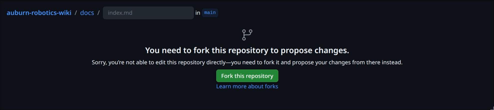
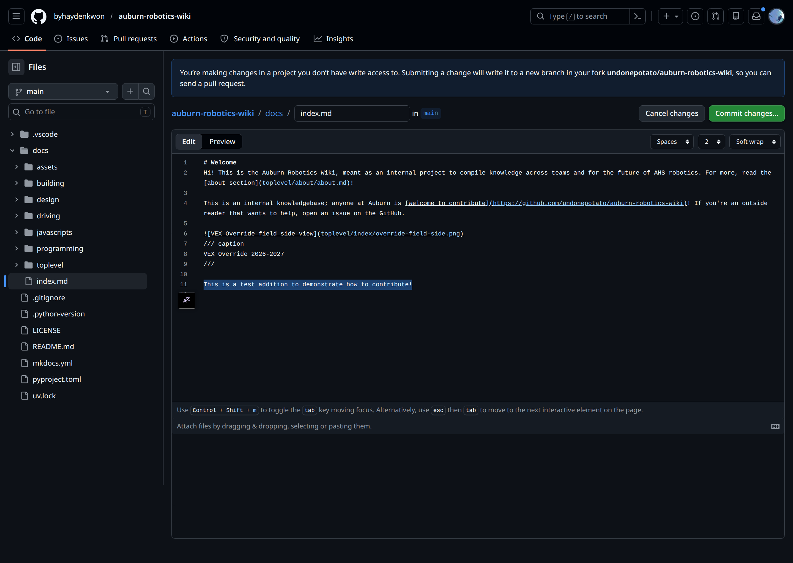
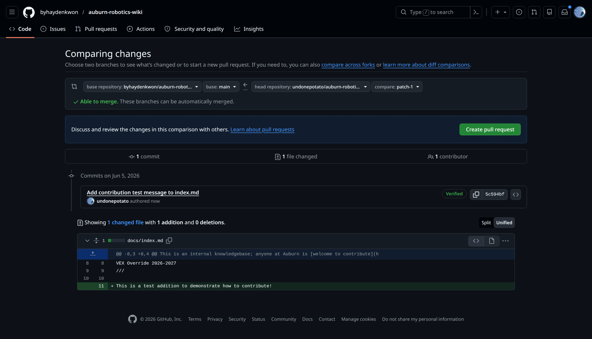
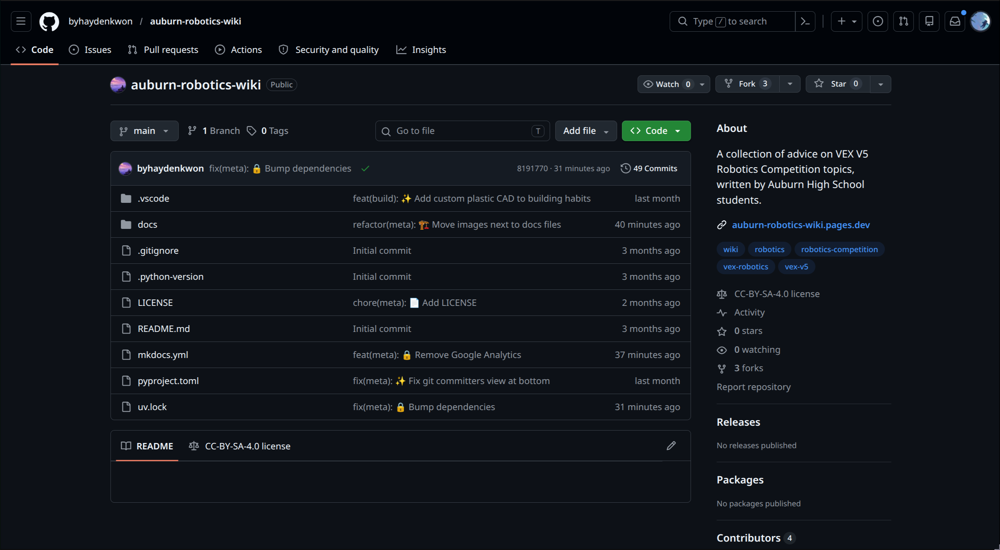
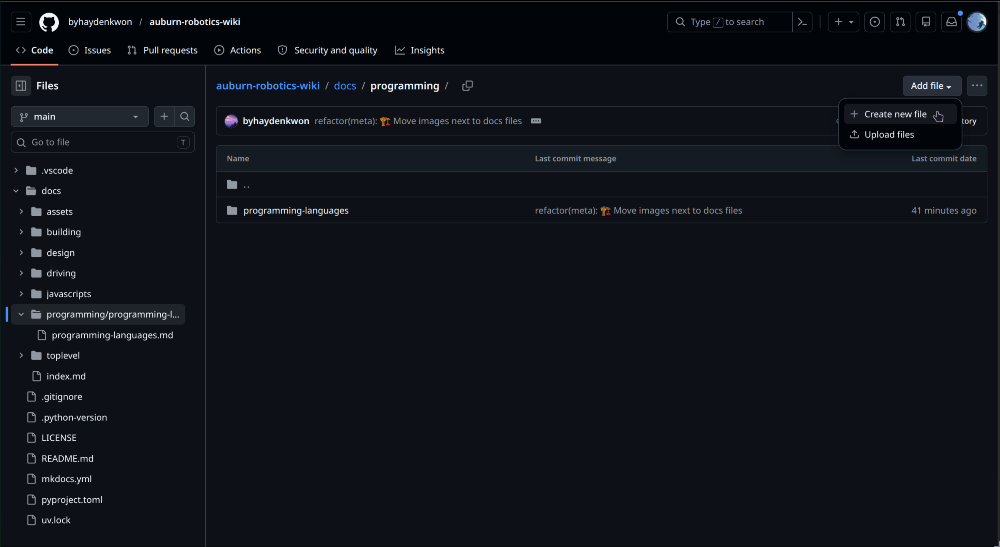
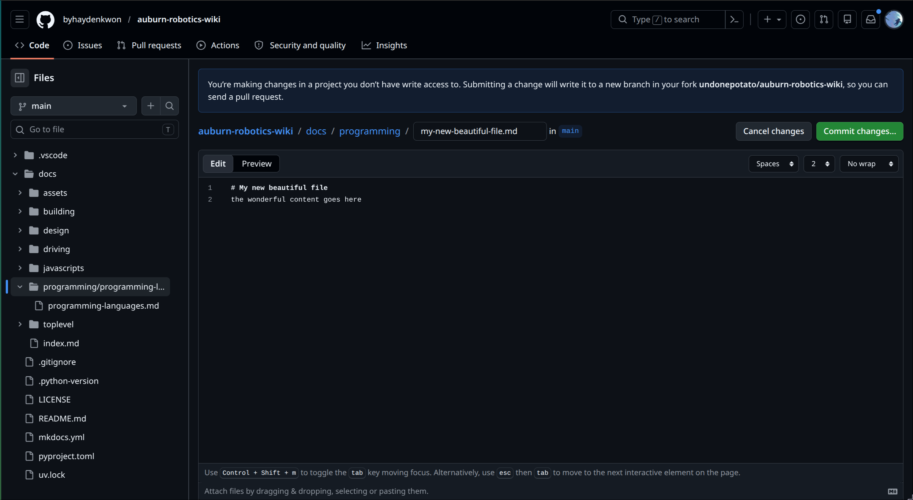

# Contributing
Thanks for considering contributing! Any knowledge related to robotics is appreciated, whether technical or not. This wiki's source files are on [GitHub](https://github.com/byhaydenkwon/auburn-robotics-wiki), and you can edit or add files there.

**Be sure to read the [Markdown](#markdown) section for formatting!**

## The Simple Way
You can just put your changes, images, and whatnot in a Google Doc or another format and send it to me on Discord. I'll format it and put it on the wiki.

It is appreciated if you can put smaller changes on the GitHub directly through the process below. You'll also be able to get direct credit for your changes through the little icons on the bottom of the wiki!

## Editing Existing Content
1. Click the edit button
2. Fork the repository and add your changes
3. Open a pull request

Press the pencil icon at the top of the page to add or edit content, then click "fork this repository". Create a GitHub account if you don't have one already.


/// caption
The edit button
///


/// caption
Fork it!
///

You can write and edit your changes here. Click the `Preview` button to see what your changes will look like—though some features will not show up in this view, so don't worry!


/// caption
The editing interface
///

When you're done, click the green button that says `Commit changes...` and add a short summary of your changes. Examples:

* Add section about Rust
* Fix typo in Fusion tutorial

Then, click the button that says `Create pull request`,


One more time:


And you're done! Your change will be reviewed and added into the wiki. Feel free to ping Hayden to let him know.

## Adding New Pages
1. Navigate to the place you want your page
2. Fork and create a new page
3. Open a pull request

First, navigate to [the project GitHub](https://github.com/byhaydenkwon/auburn-robotics-wiki):


Then, click on the `docs/` folder and choose whether your change is in `building/`, `design/`, `driving/`, or `programming/`. Once you're there, click the `Create new file` button:


There, you can title your file. **Use all lowercase letters with hyphens as spaces for the file name (kebab-case) and add a .md extension.** Also make sure to give your new page a title using a single `#` as your first line!


From here, the process is the same as that in [Editing Existing Content](#editing-existing-content). Fork, open a pull request, and you're done!

## Markdown
Markdown is a very simple language for formatting your document. It allows headings, lists, bold and italic formatting, and more. It's recommended to read at least this part.

[This cheat sheet](https://www.markdownguide.org/cheat-sheet/) is also useful.

!!! warning
    If your paragraphs seem to be joining together or lists and such won't format correctly, add two spaces (`  `) at the end of your first one and try adding another newline between them.

### Headings
Create new headings with `#` symbols. Put them consecutively, like `##`, to create subheadings. Make sure to put a space after the hashtags and the heading title!
``` markdown
# This is a level 1 heading. There should only be one of me in a single file!
## I'm a level 2 heading!
### I'm a level 3 heading!
#### You'll never guess what I am
##### Why do you need this?
###### There's also this
```
These are very useful for navigation.

### Bold and Italic Text
* **Bold text** by putting two asterisks: `**Bold text**`
* *Italicize text* by putting one asterisk: `*Italicize text*`

### Links
This syntax:
``` md
[Example site](https://example.com)
```
results in:

[Example site](https://example.com)

### Lists
An unordered list:  

* Apples
* Pears
* Oranges

``` markdown
* Apples
* Pears
* Oranges
```

An ordered list:  

1. Chocolate
2. Giraffe
3. Tomato

``` markdown
1. Chocolate
2. Giraffe
3. Tomato
```
Remember the space after the asterisk or number!

### Quotes and Admonitions
Use a block quote to make quotes stand out:
> "The secret of life, though, is to fall seven times and to get up eight times."

\- Paulo Coehlo

Or to make quotes stand out more:
!!! quote
    "The secret of life, though, is to fall seven times and to get up eight times."  
    - Paulo Coehlo

!!! note
    These boxes are called *admonitions*. Use this syntax to get them:
    ```
    !!! note
        your content goes here; remember to indent!
    ```
    For more on admonitions and all their types, see [this page](https://squidfunk.github.io/mkdocs-material/reference/admonitions/).

### Images
To add an image, click the "upload file" button and give your image a name to use. In your file, use the [link syntax](#links) like this:
```md

```
The alt text is for accessibility; people who can't load or see the image will see that text instead.

Add a caption to an image by using this syntax:
```
/// caption
Your caption here
```

### Code
Use three backticks (` ``` `) like this. This is a backtick, not a quote mark (`'`)—look to the left of your 1 key or hold down the single quote on iOS.
````
```(optionally, the name of the programming language)
your code here
```
````
For example:
````md
```python
def hello() -> None:
    print("Hello world!")
```
````

gives:

```python
def hello() -> None:
    print("Hello world!")
```

You can also do inline code `` `like this` `` ; the backticks give `like this`.

### Tables
Create a table using `-` and `|` symbols:
```md
| Alice | Bob |
| ----- | --- |
| Carol | Eve |
```

| Alice | Bob |
| ----- | --- |
| Carol | Eve |

This can be cumbersome, so using a [Markdown table generator](https://www.tablesgenerator.com/markdown_tables) is recommended. Just paste the output.

### Math
Use [$\LaTeX$](https://en.wikipedia.org/wiki/LaTeX) for formatting and use two dollar signs to start a math block. For example:

```latex
$$
\frac{T}{\sqrt{1-\frac{v^2}{c^2}}} = \frac{T}{\sqrt{1-u}} \approx T(1+\frac{1}{2}u)
$$
```

renders as:

$$
\frac{T}{\sqrt{1-\frac{v^2}{c^2}}} = \frac{T}{\sqrt{1-u}} \approx T(1+\frac{1}{2}u)
$$

Like code, use `$one dollar sign$` to create an inline math block: $E = mc^2$. Learn more about $\LaTeX$ by doing a search (you could also get AI to generate an expression).

It's recommended to use [Overleaf](https://www.overleaf.com) or another editor to make sure your expressions show up as intended.
